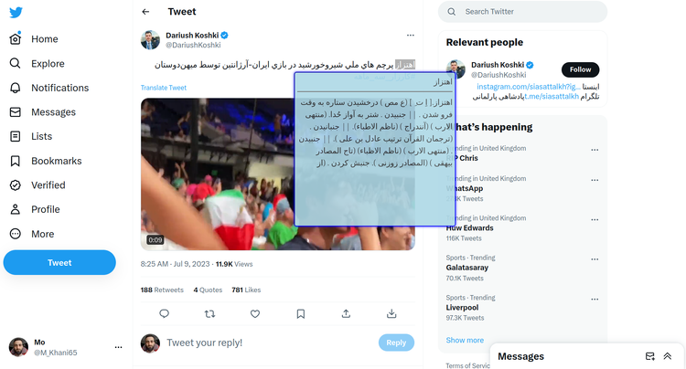
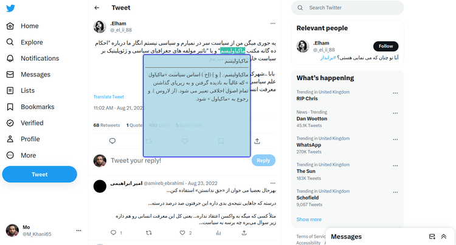

## دستیار واژه یاب
از وبسایت [**واژه‌یاب**](https://www.vajehyab.com)  که کتابخانه‌ عظیم و غنی فارسی است بعنوان دیکشنری و مترجم زبان فارسی استفاده کنید.
با این اسکریپت می‌توان برروی هر کلمه فارسی که داخل هر سایتی می‌بینید دوبار کلیک کنید و یا اون رو انتخاب کنید تا بلافاصله یک پاپ‌آپ کوچک با اطلاعاتی درباره اون کلمه روی صفحه ظاهر بشه، اطلاعات مانند معنی، معادل فارسی و سایر خدماتی که سایت واژه‌یاب ارایه می‌دهد.

#### طریقه نصب
ابتدا باید یکی از افزونه‌ها مثل [Tampermonkey](https://www.tampermonkey.net/) و یا گزینه‌های مشابه دیگر را نصب بکنید. برای تمامی مرورگرهای موجود می باشد.
سپس با انتخاب [Vajehyab-Assistant.user.js](https://github.com/Amm1rr/Vajehyab-Assistant/raw/main/Vajehyab-Assistant.user.js) امکان نصب براتون فعال میشه.

> **نکته:** می‌توانید یکی از افزونه‌های **GreaseMonkey / TamperMonkey / Violentmonkey** رو انتخاب و نصب کنید.این افزونه‌ها در کارایی تفاوتی باهم ندارند، ولی من **[Tampermonkey](https://www.tampermonkey.net)** رو بیشتر می‌پسندم.

#### یک روش دیگر برای نصب:
بعد از نصب یکی از افزونه‌های ذکر شده، به سایت [Greasyfork](https://greasyfork.org/en/scripts/438293-vajehyab-assistan) برید و برروی دکمه **نصب** کلیک کنید.

    https://greasyfork.org/en/scripts/438293-vajehyab-assistan

### نکته
 یکی از دلایلی که من این اسکریپت رو نوشتم، بخاطر توییتر بود، توییتهایی که معنی کلمات رو نمیدونستم با این اسکریپت راحت همه چیز رو درباره اون کلمه بدون اینکه از توییتر خارج بشم بدست میارم. همچنین توی مقالات هم می‌شود از این اسکریپت استفاده کرد.
کلا سایت واژه‌یاب به نظرم یکی از بهترین وبسایت‌های خدمات رسانی فارسی هستش که همه باید بیشتر باهاش آشنا بشند.
توی تویتتر متأسفانه دیدم که چقدر املای هممون ضعیف شده، با این اسکریپت و اسکریپت‌های مشابه میخوام قدم کوچیکی به این بی‌تفاوتی بردارم. روند توسعه‌اش هم فکر کنم چون خودم به این مبحث علاقه دارم، حالاحالا ها ازش استفاده کنم.
  

 

## Vajehyab Assistant
Use the [**VajehYab.com**](https://www.vajehyab.com) website as a dictionary, Just by double-clicking or selecting any text, the results appear as a smooth light pop-up.
It's a Translator that you can use **Ctrl + Alt + Q** to toggle enable\disable Vajehyab Assistant functionality.

Especially on Twitter and reading an article, you can quickly access one of the best Farsi databases in the World.

  

  

### How to Use
First, you should install one of **GreaseMonkey / TamperMonkey / Violentmonkey** or similar browser add-ons for your browser **Chrome / Firefox / Edge / Opera / Safari**.

##### I recommend [Tampermonkey](https://www.tampermonkey.net/):
    https://www.tampermonkey.net/

After installing the extension you can install [**Vajehyab-Assistant.user.js**](https://github.com/Amm1rr/Vajehyab-Assistant/raw/main/Vajehyab-Assistant.user.js).

#### Another way

You can install VajehYab Assistant by [**GreasyFork website**][Greasyfork]:

    https://greasyfork.org/en/scripts/438293-vajehyab-assistan

 
